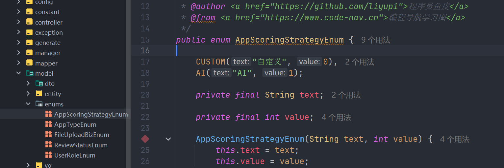
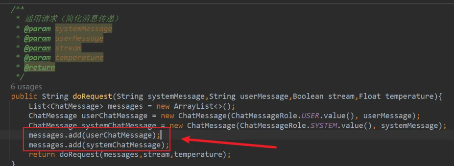
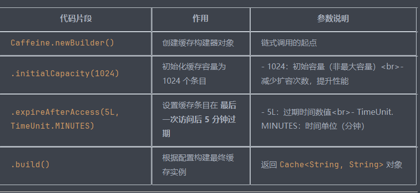
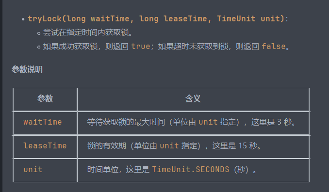

# 一、用户可以通过上传题目和自定义评分规则，创建答题应用，供其他用户检索和使用。  
## 1.1 查看数据库设计
一共有一个数据库，名字是yudada，数据库表一共五张  
## 1.2 查看表设计  
### 1.2.1 用户表 user
```mysql

create table if not exists user
(
    id           bigint auto_increment comment 'id' primary key,
    userAccount  varchar(256)                           not null comment '账号',
    userPassword varchar(512)                           not null comment '密码',
    unionId      varchar(256)                           null comment '微信开放平台id',
    mpOpenId     varchar(256)                           null comment '公众号openId',
    userName     varchar(256)                           null comment '用户昵称',
    userAvatar   varchar(1024)                          null comment '用户头像',
    userProfile  varchar(512)                           null comment '用户简介',
    userRole     varchar(256) default 'user'            not null comment '用户角色：user/admin/ban',
    createTime   datetime     default CURRENT_TIMESTAMP not null comment '创建时间',
    updateTime   datetime     default CURRENT_TIMESTAMP not null on update CURRENT_TIMESTAMP comment '更新时间',
    isDelete     tinyint      default 0                 not null comment '是否删除',
    index idx_unionId (unionId)
) comment '用户' collate = utf8mb4_unicode_ci;
```
需要明确字段值的含义,id为主键，自增，userAccount为账号，userPassword为密码，  
unionId为微信开放平台id，mpOpenId为公众号openId，userName为用户昵称，  
userAvatar为用户头像，userProfile为用户简介，userRole为用户角色，  
createTime为创建时间，updateTime为更新时间，isDelete为是否删除，  
idx_unionId为索引，用于查询。
### 1.2.2 应用表 app 
```mysql
create table if not exists app
(
    id              bigint auto_increment comment 'id' primary key,
    appName         varchar(128)                       not null comment '应用名',
    appDesc         varchar(2048)                      null comment '应用描述',
    appIcon         varchar(1024)                      null comment '应用图标',
    appType         tinyint  default 0                 not null comment '应用类型（0-得分类，1-测评类）',
    scoringStrategy tinyint  default 0                 not null comment '评分策略（0-自定义，1-AI）',
    reviewStatus    int      default 0                 not null comment '审核状态：0-待审核, 1-通过, 2-拒绝',
    reviewMessage   varchar(512)                       null comment '审核信息',
    reviewerId      bigint                             null comment '审核人 id',
    reviewTime      datetime                           null comment '审核时间',
    userId          bigint                             not null comment '创建用户 id',
    createTime      datetime default CURRENT_TIMESTAMP not null comment '创建时间',
    updateTime      datetime default CURRENT_TIMESTAMP not null on update CURRENT_TIMESTAMP comment '更新时间',
    isDelete        tinyint  default 0                 not null comment '是否删除',
    index idx_appName (appName)
) comment '应用' collate = utf8mb4_unicode_ci;

```
明确字段值的含义,id为主键，自增，appName为应用名，appDesc为应用描述，  
appIcon为应用图标，appType为应用类型，scoringStrategy为评分策略  
review开头的都为审核相关的字段，reviewStatus为审核状态，reviewMessage为审核信息， 
### 1.2.3 题目表 question
```mysql
create table if not exists question
(
    id              bigint auto_increment comment 'id' primary key,
    questionContent text                               null comment '题目内容（json格式）',
    appId           bigint                             not null comment '应用 id',
    userId          bigint                             not null comment '创建用户 id',
    createTime      datetime default CURRENT_TIMESTAMP not null comment '创建时间',
    updateTime      datetime default CURRENT_TIMESTAMP not null on update CURRENT_TIMESTAMP comment '更新时间',
    isDelete        tinyint  default 0                 not null comment '是否删除',
    index idx_appId (appId)
) comment '题目' collate = utf8mb4_unicode_ci;

```
需要理解的是app是创建的一套题，包含多个题目，题目内容为json格式  
### 1.2.4 评分结果表 scoring_result
```mysql
-- 评分结果表
create table if not exists scoring_result
(
    id               bigint auto_increment comment 'id' primary key,
    resultName       varchar(128)                       not null comment '结果名称，如物流师',
    resultDesc       text                               null comment '结果描述',
    resultPicture    varchar(1024)                      null comment '结果图片',
    resultProp       varchar(128)                       null comment '结果属性集合 JSON，如 [I,S,T,J]',
    resultScoreRange int                                null comment '结果得分范围，如 80，表示 80及以上的分数命中此结果',
    appId            bigint                             not null comment '应用 id',
    userId           bigint                             not null comment '创建用户 id',
    createTime       datetime default CURRENT_TIMESTAMP not null comment '创建时间',
    updateTime       datetime default CURRENT_TIMESTAMP not null on update CURRENT_TIMESTAMP comment '更新时间',
    isDelete         tinyint  default 0                 not null comment '是否删除',
    index idx_appId (appId)
) comment '评分结果' collate = utf8mb4_unicode_ci;

```
result就是和结果相关的，其他的键可以和其他的表相关联，对于其他的表也是一样  
### 1.2.5 用户答题记录表 user_answer
```mysql
-- 用户答题记录表
create table if not exists user_answer
(
    id              bigint auto_increment primary key,
    appId           bigint                             not null comment '应用 id',
    appType         tinyint  default 0                 not null comment '应用类型（0-得分类，1-角色测评类）',
    scoringStrategy tinyint  default 0                 not null comment '评分策略（0-自定义，1-AI）',
    choices         text                               null comment '用户答案（JSON 数组）',
    resultId        bigint                             null comment '评分结果 id',
    resultName      varchar(128)                       null comment '结果名称，如物流师',
    resultDesc      text                               null comment '结果描述',
    resultPicture   varchar(1024)                      null comment '结果图标',
    resultScore     int                                null comment '得分',
    userId          bigint                             not null comment '用户 id',
    createTime      datetime default CURRENT_TIMESTAMP not null comment '创建时间',
    updateTime      datetime default CURRENT_TIMESTAMP not null on update CURRENT_TIMESTAMP comment '更新时间',
    isDelete        tinyint  default 0                 not null comment '是否删除',
    index idx_appId (appId),
    index idx_userId (userId)
) comment '用户答题记录' collate = utf8mb4_unicode_ci;
```
该表中的字段都可以和其他的表关联，如appId和userId，score等都可以和别的表关联，  
## 1.3 初始化项目
### 1.3.1 准备模版 
### 1.3.2 安装依赖  
### 1.3.3 执行sql脚本创建测试数据  
### 1.3.4 模板改造，改模块，改包名，移除不需要的模块，配置以为自己的需求进行修改  
## 2.0 后端增删改查  
### 2.1 数据访问层  
使用mybatisX生成代码，移动复制  
```
@TableName(value ="app");//@TableName 注解用于指定Java实体类与数据库表的对应关系
@TableId(type = IdType.ASSIGN_ID)
    private Long id;
* @TableId 用于标识实体类的主键字段，当字段名与数据库列名不一致时可配合value属性使用
* @param type 指定主键生成策略（IdType.ASSIGN_ID 表示由应用层分配主键）
*  - ASSIGN_ID 策略：使用雪花算法生成分布式唯一ID（Long/String类型）
*  - 需要数据库字段设置为BIGINT类型与之匹配
*  - 适用于分布式系统，可避免主键冲突
@TableLogic
    private Integer isDelete;
* @TableLogic 实现逻辑删除功能的核心配置，符合本系统isDelete字段设计
*
* 工作机制：
* 1. 删除操作转化：当执行delete操作时，实际执行的是UPDATE语句
* - 示例：DELETE FROM app WHERE id=1
* → UPDATE app SET is_delete=1 WHERE id=1
*
* 2. 查询自动过滤：所有SELECT语句会自动添加WHERE is_delete=0条件
* - 示例：SELECT * FROM app
* → SELECT * FROM app WHERE is_delete=0
@TableField(exist = false)//表示不是数据库映射字段
private static final long serialVersionUID = 1L;//Java 序列化机制使用的版本标识符


```
### 2.2 业务逻辑代码  
使用codeGernerator生成，包括controller，service，impl，实现类，数据包装类，枚举类
### 2.3 数据模型开发
  编写数据模型包装类（请求类和视图类）、JSON 结构对应的类、枚举类。  
包装类需要根据前端实际传递的请求参数或需要的响应结果自行修改  

添加应用流程，根据前端的dto,首先校验dto是否为空  
生成应用对象，将dto转换为应用对象，  
从session中获取用户信息，根据用户的id向数据库内更新应用信息  
返回状态码  
```java
QueryWrapper<User> queryWrapper = new QueryWrapper<>();
queryWrapper.eq("userAccount", userAccount);
long count = this.baseMapper.selectCount(queryWrapper);
if (count > 0) {
throw new BusinessException(ErrorCode.PARAMS_ERROR, "账号重复");
}

```

# 二、接入智普ai遇到的问题  
# 三、开发问题 
## 解决策略选择
1. 自定义ai得分类和测评类策略模式
   public @interface ScoringStrategyConfig是自定义注解，  
   `appType = 1: 表示该评分策略适用于应用类型为1的应用。应用类型可能是系统中预定义的不同类型的测评或应用程序的标识。
   scoringStrategy = 1: 表示具体的评分策略类型为1。  
   这可能意味着不同的评分逻辑或算法。使用@interface 定义的注解，可以方便的在代码中添加一些元数据，用于描述类的功能、属性、方法等。  
   `
2. 调用该方法UserAnswer doScore(List<String> choiceList, App app)传入应用的app属性，可以获取应用的类型  
3. @ScoringStrategyConfig所有带有该注解的类，都会被扫描到，  
 并生成对应的bean，然后注入到容器中。  
4. 依次遍历然后和应用类型进行匹配，然后调用对应的doScore()方法
     
5. bingou  
## 向 @PostMapping("/ai_generate")发送请求 
```java
private String getGenerateQuestionUserMessage(App app, int questionNumber, int optionNumber) {
        StringBuilder userMessage = new StringBuilder();
        userMessage.append(app.getAppName()).append("\n");
        userMessage.append(app.getAppDesc()).append("\n");
        userMessage.append(AppTypeEnum.getEnumByValue(app.getAppType()).getText() + "类").append("\n");
        userMessage.append(questionNumber).append("\n");
        userMessage.append(optionNumber);
        return userMessage.toString();
    }

    @PostMapping("/ai_generate")
    public BaseResponse<List<QuestionContentDTO>> aiGenerateQuestion(@RequestBody AiGenerateQuestionRequest aiGenerateQuestionRequest) {
        ThrowUtils.throwIf(aiGenerateQuestionRequest == null, ErrorCode.PARAMS_ERROR);
        // 获取参数
        Long appId = aiGenerateQuestionRequest.getAppId();
        int questionNumber = aiGenerateQuestionRequest.getQuestionNumber();
        int optionNumber = aiGenerateQuestionRequest.getOptionNumber();
        App app = appService.getById(appId);
        ThrowUtils.throwIf(app == null, ErrorCode.NOT_FOUND_ERROR);
        // 封装 Prompt
        String userMessage = getGenerateQuestionUserMessage(app, questionNumber, optionNumber);
        // AI 生成，传入的分别是模板和用户信息
        String result = aiManager.doSyncUnstableRequest(GENERATE_QUESTION_SYSTEM_MESSAGE, userMessage);
        // 结果处理
        int start = result.indexOf("[");
        int end = result.lastIndexOf("]");
        //分割从[],获取json格式的字符串
        String json = result.substring(start, end + 1);
        List<QuestionContentDTO> questionContentDTOList = JSONUtil.toList(json, QuestionContentDTO.class);
//        返回给前端
        return ResultUtils.success(questionContentDTOList);
    }

```
## 使用智普回答测评类问题使用相似逻辑  
## 对于报错信息 java.net.SocketTimeoutException: timeout 的处理  
1. 
```xml
   <dependency>
   <groupId>cn.bigmodel.openapi</groupId>
   <artifactId>oapi-java-sdk</artifactId>
   <version>release-V4-2.0.2</version>
   </dependency>
```
最开始使用的版本是 <version>release-V4-2.3.2</version>，  
但是一直报错，后来使用release-V4-2.0.1版本，问题解决。  
2. `如果用最新版本的话，创建客户端的方式要用最新的，https://github.com/MetaGLM/zhipuai-sdk-java-v4。  
然后模型可以换成最新的，我是换成最新的GLM-4-Plus，不过哪个模型常量里没这个，我是官网查的最新的模型代码，  
然后前端的超时时间也是跟鱼一样的，创建30个题目，4个选项，目前没啥问题，  
不过少数情况题目选项生成为空，可以在系统消息哪里在加点要求`
## 系统和用户Propmt和yupi一样，但结果预期相差太大  
  
```java
public String doRequest(String systemMessage,String userMessage,Boolean stream,Float temperature){
    List<ChatMessage> messages = new ArrayList<>();
    ChatMessage userChatMessage = new ChatMessage(ChatMessageRole.USER.value(), userMessage);
    ChatMessage systemChatMessage = new ChatMessage(ChatMessageRole.SYSTEM.value(), systemMessage);
    //先加系统Prompt
    messages.add(systemChatMessage);
    //再加用户Prompt
    messages.add(userChatMessage);
    return doRequest(messages,stream,temperature);
}
```
对于生成题目的代码写在了controller层中，为了方便，应写在service层中，或者封装其他位置或者工具类
`private static final long serialVersionUID = 1L;`  
serialVersionUID 用于确保序列化和反序列化过程中类的版本一致性。  
在这个例子中，serialVersionUID 被显式地设置为 1L，并且是 final 的，确保其值不会被修改。  

# 四、性能优化
## （一）通过数据流的方式优化输出结果  
`响应式编程（Reactive Programming）是一种编程范式，  
它专注于 异步数据流 和 变化传播。响应式编程的核心思想是“数据流是第一等公民”，程序的逻辑建立在数据流的变化之上`
`在 RxJava 中，观察者就是 Observer，被观察者是 Observable 和 Flowable。RDh8EnpzQzvd2bZPHBvPPLojh0uwd5dqEwE1C9Nd4Uw=
Observable 适合处理相对较小的、可控的、不会迅速产生大量数据的场景。它不具备背压处理能力，也就是说，当数据生产速度超过数据消费速度时，可能会导致内存溢出或其他性能问题。
Flowable 是针对背压（反向压力）问题而设计的可观测类型。背压问题出现于数据生产速度超过数据消费速度的场景。Flowable 提供了多种背压策略来处理这种情况，确保系统在处理大量数据时仍然能够保持稳定。
被观察者.subscribe(观察者)，它们之间就建立的订阅关系，被观察者传输的数据或者发出的事件会被观察者观察到。`

### 什么是RxJava  
`什么是 RxJava？
RxJava 是一个基于事件驱动的、利用可观测序列来实现异步编程的类库，  
是响应式编程在 Java 语言上的实现。`   
### 什么是sse 
`服务器发送事件（Server-Sent Events）是一种用于从服务器到客户端的  
单向、实时 数据传输技术，基于 HTTP协议实现。`  
1. 单向通信：SSE 只支持服务器向客户端的单向通信，客户端不能向服务器发送数据。
2. 文本格式：SSE 使用 纯文本格式 传输数据，使用 HTTP 响应的 text/event-stream MIME 类型。
3. 保持连接：SSE 通过保持一个持久的 HTTP 连接，实现服务器向客户端推送更新，而不需要客户端频繁轮询。
4. 自动重连：如果连接中断，浏览器会自动尝试重新连接，确保数据流的连续性。  
回归到本项目，具体实现方案如下：  
1）前端向后端发送普通 HTTP 请求  
2）后端创建 SSE 连接对象，为后续的推送做准备  
3）后端流式调用智谱 AI，获取到数据流，使用 RxJava 订阅数据流  
4）以 SSE 的方式响应前端，至此接口主流程已执行完成  
5）异步：基于 RxJava 实时获取到智谱 AI 的数据，并持续将数据拼接为字符串，当拼接出一道完整题目时，通过 SSE 推送给前端  
6）前端每获取一道题目，立刻插入到表单项中   
```java
@GetMapping("/ai_generate/sse")
    public SseEmitter aiGenerateQuestionSSE(AiGenerateQuestionRequest aiGenerateQuestionRequest) {
        ThrowUtils.throwIf(aiGenerateQuestionRequest == null, ErrorCode.PARAMS_ERROR);
        // 获取参数，题目个数，每个题目选项个数
        Long appId = aiGenerateQuestionRequest.getAppId();
        int questionNumber = aiGenerateQuestionRequest.getQuestionNumber();
        int optionNumber = aiGenerateQuestionRequest.getOptionNumber();
        // 获取应用信息
        App app = appService.getById(appId);
        ThrowUtils.throwIf(app == null, ErrorCode.NOT_FOUND_ERROR);

        // 封装 Prompt
        String userMessage = getGenerateQuestionUserMessage(app, questionNumber, optionNumber);
        // 建立 SSE 连接对象，0 表示不超时
        SseEmitter emitter = new SseEmitter(0L);
        // AI 生成，调用sse方法 流式返回 使用配置类的密钥
        Flowable<ModelData> modelDataFlowable = aiManager.doStreamRequest(GENERATE_QUESTION_SYSTEM_MESSAGE, userMessage, null);
        StringBuilder contentBuilder = new StringBuilder();
        AtomicInteger flag = new AtomicInteger(0);
        modelDataFlowable
                // 异步线程池执行-Schedulers.io() 作用：将后续操作切换到 I/O 线程池执行
                .observeOn(Schedulers.io())
//     *map(提取内容 ：`ModelData` 对象（AI响应块
//       作用：切换后续操作到 I/O 线程池执行
//   参数：Schedulers.io() 表示使用 RxJava 内置的 I/O 型线程池（适合阻塞操作）
//   场景意义：将 AI 流式响应数据的处理与网络接收线程分离，避免阻塞主线程

           .map(chunk -> chunk.getChoices().get(0).getDelta().getContent())
//                chunk: 智普 AI 流式返回的 ModelData 对象
//   chunk.getChoices(): 获取响应选项列表（通常单元素）
//.getDelta().getContent(): 提取增量内容（流式返回的文本片段）
//   输出：String 类型的文本块（如 "题目1..."）
                .map(message -> message.replaceAll("\\s", ""))
//               替换所有空白字符串
                .filter(StrUtil::isNotBlank)
                .flatMap(message -> {
                    // 将字符串转换为 List<Character>
                    List<Character> charList = new ArrayList<>();
                    for (char c : message.toCharArray()) {
                        charList.add(c);
                    }
                    return Flowable.fromIterable(charList);
                })
//                每一次传来一个字符数据流c就执行操作
                .doOnNext(c -> {
                    {
                        // 识别第一个 [ 表示开始 AI 传输 json 数据，打开 flag 开始拼接 json 数组
                        if (c == '{') {
                            flag.addAndGet(1);
                        }
                        if (flag.get() > 0) {
                            contentBuilder.append(c);
                        }
                        if (c == '}') {
                            flag.addAndGet(-1);
                            if (flag.get() == 0) {
                                // 累积单套题目满足 json 格式后，sse 推送至前端
                                // sse 需要压缩成当行 json，sse 无法识别换行
                                emitter.send(JSONUtil.toJsonStr(contentBuilder.toString()));
                                // 清空 StringBuilder
                                contentBuilder.setLength(0);
                            }
                        }
                    }
                }).doOnComplete(emitter::complete).subscribe();
        return emitter;
    }
```
### 前端部分  
```javascript
const handleSSESubmit = async () => {
  if (!props.appId) {
    return;
  }
  // 开启加载sse链接加载状态
  sseSubmitting.value = true;
  // 创建 SSE 请求
  // 为什么 要用 EventSource
  // 长连接保持
  // 普通 HTTP 请求：单次请求-响应后立即断开
  // EventSource：保持长连接，服务器可随时推送消息
  // 协议支持
  // 常规请求：仅支持即时响应
  // EventSource：基于 SSE 协议（text/event-stream），支持流式传输

  const eventSource = new EventSource(
    // todo 手动填写完整的后端地址
    "http://localhost:8101/api/question/ai_generate/sse" +
      `?appId=${props.appId}&optionNumber=${form.optionNumber}&questionNumber=${form.questionNumber}`
  );
  let first = true;
  // 接收消息
  eventSource.onmessage = function (event) {
    if (first) {
      props.onSSEStart?.(event);
      // 开始生成题目的时候需要关闭抽屉组件
      handleCancel();
      first = !first;
    }
    // 将传输过来的emitter转化为json格式
    props.onSSESuccess?.(JSON.parse(event.data));
  };
  // 报错或连接关闭时触发
  eventSource.onerror = function (event) {
    if (event.eventPhase === EventSource.CLOSED) {
      console.log("关闭连接");
      props.onSSEClose?.(event);
      eventSource.close();
    } else {
      eventSource.close();
    }
  };
  sseSubmitting.value = false;
};
```

## （二）使用缓存提高评分效率  
业务流程  
1）在 AI 回答前，哈希处理用户答题选择，得到摘要，拼接缓存 key。   
2）通过摘要查找缓存，若命中则直接返回答题结果。  
3）若缓存中未找到，则请求 AI   
4）正确解析 AI 返回的 JSON 后，将其放置在缓存中。  
缓存击穿问题解决  
思考：如果同一时刻有大量的用户答题，比如 1w 个用户，且答题选择都是一致的，  
但没有命中缓存（刚好过期），这时候会有 1w 个请求并发访问 AI。  
这其实就是缓存击穿问题，即大量请求并发访问热点数据，刚好热点数据过期，会直接绕过缓存  
命中数据库或 AI 接口。  
**解决方法**  
`因此，我们需要避免缓存击穿，一种常见的解决方式就是加锁。如果服务部署在多个机器上，就必须要使用分布式锁。
分布式锁不建议自己实现，理解原理即可。可以直接使用 Redisson 客户端，它为 Redis 提供了多种数据结构的支持，并提供了线程安全的操作，简化了在 Java 中使用 Redis 的复杂度。
Redisson 对 Redis 的一些功能进行了增强，如分布式锁、计数器、队列等，使得 Redis 的使用更加方便。`

### Caffeine实现本地缓存
  添加依赖
```xml
<dependency>
  <groupId>org.redisson</groupId>
  <artifactId>redisson</artifactId>
  <version>3.21.0</version>
</dependency>
<dependency>
  <groupId>com.github.ben-manes.caffeine</groupId>
  <artifactId>caffeine</artifactId>
  <version>2.9.2</version>
</dependency>
```
```java
//创建caffeine缓存
private final Cache<String, String> answerCacheMap = 
    Caffeine.newBuilder()
        .initialCapacity(1024)
        .expireAfterAccess(5L, TimeUnit.MINUTES)
        .build();
//自定义压缩方式求key
private String buildCacheKey(Long appId, String choices) {
   return DigestUtil.md5Hex(appId + ":" + choices);
}
```

根据appId和choices生成key，然后通过key去cache中查询如果命中则直接返回，  
如果没有命中就需要请求ai回答，通过锁的逻辑竞争，如果获取锁成功则请求ai回答，如果获取锁失败则直接返回。
### redis实现分布式缓存  
1. 在配置文件中配置redisson客户端连接信息，如ip、端口、密码等，如果没有密码需要注释掉不能乱写  
2. 创建redisson配置类  
   `@Configuration
   @ConfigurationProperties(prefix = "spring.redis")
   @Data
   public class RedissonConfig {
   private String host;
   private Integer port;
   private Integer database;
   private String password;
   @Bean
   public RedissonClient redissonClient() {
   Config config = new Config();
   config.useSingleServer()
   .setAddress("redis://" + host + ":" + port)
   .setDatabase(database)
   .setPassword(password);
   return Redisson.create(config);
   }
   }`  
3. 因为方便所以在ai得分策略类中添加一个分布式锁实现评测逻辑
4. 调用doSyncStableRequest()实现获取答案
5. 响应给前端

`RLock lock = redissonClient.getLock(AI_ANSWER_LOCK + cacheKey);`  
调用 Redisson 客户端的 getLock 方法，创建一个基于 Redis 的分布式锁对象  
锁的名称由 AI_ANSWER_LOCK + cacheKey 拼接而成，确保每个缓存键（cacheKey）对应唯一的锁  
**AI_ANSWER_LOCK确保不同的业务场景下，锁名不冲突**    
在指定的时间内获取锁，排队  
`boolean res = lock.tryLock(3, 15, TimeUnit.SECONDS);
`  
    
` answerCacheMap.put(cacheKey, json);`
当拍到队后，将生成的答案按照json格式转换后设置缓存缓存,然后向前端返回数据  
`finally {
//自己只能关闭自己的锁
if (lock != null && lock.isLocked()) {
if (lock.isHeldByCurrentThread()) {
lock.unlock();
 }
}`  
关闭锁的逻辑：首先所不是空的，然后判断锁是否被当前线程持有，如果持有则解锁，否则不处理。  
**注意，一定要加 try ... finally 块，保证锁被加锁的线程及时释放，否则会影响业务。**
# 系统优化
## 幂等设计   
**什么是幂等性**  
幂等性是指一个请求，不管执行多少次，结果都一样。比如支付扣款或者发货等  
对于该项目中，如果用户选择完答案后，快速点击答题接口，数据库可能会产生多条相同的回答记录，并且调用多次 A
### 方案选型  
1. 数据库唯一索引  
   比如将数据库订单表中的订单号字段配置成唯一索引，用户生成订单会执行 insert 语句，MySQL 根据唯一索引天然阻止相同订单号数据的插入，我们可以 catch 住报错，让接口正常返回插入成功结果。
```java
try {
  insertOrder({id: xxx});  
} catch(DuplicateKeyException e) {
  return true;
}
```  
对应订单插入  
```java
INSERT INTO order (id,orderNo,xx,updateTime) VALUES (1,2,3,"2024-05-28 15:55:18")
  ON DUPLICATE KEY UPDATE updateTime = now();
```
2. 数据库乐观锁   
`乐观锁并不是真的加锁，而是可以给配置表加一个 version 版本号字段，每次修改需要验证版本号是否等于修改前的  
（没被别人同时修改），然后才能给版本号加 1。`
3. 天然幂等操作  
4. 分布式锁   
   多个线程需要先抢占锁才能进行后续的业务操作，因此 1、2、3 这三个步骤在同一时刻仅会有一个线程执行，所以不会存在数据不一致的情况。
也因此加了锁之后，这个业务代码可以进行多次调用，因为除了第一次的调用，后续通过 if 判断，都不会插入数据。

解决实现，复用主键  
1）在 UserAnswerController 下新增生成 id 的接口：  
```java
@GetMapping("/generate/id")
public BaseResponse<Long> generateUserAnswerId() {
    return ResultUtils.success(IdUtil.getSnowflakeNextId());
}

```
2）修改创建 userAnswer 的验证规则，补充校验 id 的逻辑  
```java
@Override
public void validUserAnswer(UserAnswer userAnswer, boolean add) {
    ThrowUtils.throwIf(userAnswer == null, ErrorCode.PARAMS_ERROR);
    // 从对象中取值
    Long appId = userAnswer.getAppId();
    Long id = userAnswer.getId();
    // 创建数据时，参数不能为空
    if (add) {
        // 补充校验规则
        ThrowUtils.throwIf(appId == null || appId <= 0, ErrorCode.PARAMS_ERROR, "appId 非法");
        ThrowUtils.throwIf(id == null || id <= 0, ErrorCode.PARAMS_ERROR, "id 不存在");
    }
    ...
}

```
4）提交用户答案的请求参数补充 id 字段，代码如下：  
```java
@Data
public class UserAnswerAddRequest implements Serializable {
    /**
     * id
     */
    private Long id;
    
    /**
     * 应用 id
     */
    private Long appId;

    /**
     * 用户答案（JSON 数组）
     */
    private List<String> choices;

    private static final long serialVersionUID = 1L;
}

``` 
5）修改提交用户答案接口，将 id 填充到回答对象中并插入到数据库（默认会通过 BeanUtils.copyProperties 填充）。并且捕获主键重复的异常，直接忽略即可。  
```java
// 写入数据库
try {
    boolean result = userAnswerService.save(userAnswer);
    ThrowUtils.throwIf(!result, ErrorCode.OPERATION_ERROR);
} catch (DuplicateKeyException e) {
    // ignore error
}
```
## 线程池隔离  
Schedulers.io()全局共享当访问量足够大的时候导致线程池被耗尽，从而导致请求被拒绝。
1.自定义线程池
```java
import io.reactivex.Scheduler;
import io.reactivex.schedulers.Schedulers;

@Configuration
@Data
public class VipSchedulerConfig {

    @Bean
    public Scheduler vipScheduler() {
        ThreadFactory threadFactory = new ThreadFactory() {
            private final AtomicInteger threadNumber = new AtomicInteger(1);

            @Override
            public Thread newThread(Runnable r) {
                Thread t = new Thread(r, "VIPThreadPool-" + threadNumber.getAndIncrement());
                t.setDaemon(false); // 设置为非守护线程
                return t;
            }
        };

        ExecutorService executorService = Executors.newScheduledThreadPool(10, threadFactory);
        return Schedulers.from(executorService);
    }
}
```
2.创建接口
```java
// 注入 VIP 线程池
@Resource
private Scheduler vipScheduler;

@GetMapping("/ai_generate/sse")
public SseEmitter aiGenerateQuestionSSE(
    AiGenerateQuestionRequest aiGenerateQuestionRequest,
    HttpServletRequest request) {
    ...
    // 默认全局线程池
    Scheduler scheduler = Schedulers.single();
    User loginUser = userService.getLoginUser(request);
    // 如果用户是 VIP，则使用定制线程池
    if ("vip".equals(loginUser.getUserRole())) {
        scheduler = vipScheduler;
    }
    // 订阅流
    modelDataFlowable
        .observeOn(scheduler)
        .subscribe();
    return sseEmitter;
}

```
## 系统分析功能
**可以利用 SQL 提供的聚合函数：如 SUM()，AVG()，COUNT()，MAX()，MIN()，来计算总数、平均值、计数、最大值和最小值；利用 GROUP BY   
对数据进行分组统计；利用 JOIN 将多个表关联在一起等等。**
自定义sql
```java
public interface UserAnswerMapper extends BaseMapper<UserAnswer> {
    // 获取某应用答题的所有用户 id
    @Select("select distinct(userId) from user_answer where appId = #{appId}")
    List<Long> getUserIdListByAppId(Long appId);

    // 删除某应用所有的回答
    @Delete("delete from user_answer where appId = #{appId}")
    int deleteByAppId(Long appId);
}

```   
后端 定义接口，返回值，相应路径，mvc，DTO
前端引用数据可视化类库组件  
vue实现数据可视化:https://github.com/ecomfe/vue-echarts  
echarts开源图标库:https://echarts.apache.org/zh/index.html  
新建路由，视图，编辑响应函数
## 应用分享功能  
**复制链接分享**  
直接用 Arco Design 的可复制文本组件，也可以使用文本复制组件，  
比如 copy-text-to-clipboard：https://www.npmjs.com/package/copy-text-to-clipboard。

**移动端扫码分享**  
移动端扫码分享可以使用 qrcode 组件：https://www.npmjs.com/package/qrcode
原理是将链接作为文本，转换为二维码图片。  
参考文档：https://developers.weixin.qq.com/doc/offiaccount/OA_Web_Apps/JS-SDK.html#10
开发实现  
1. 在前端页面引入
1）qrcode 组件  
```java
npm install --save qrcode

```  
2）新增 ShareModal 组件，编写 Demo：  
```vue

<template>
  <div>{{ link }}</div>
  
</template>

<script setup lang="ts">
import QRCode from "qrcode";
import { ref } from "vue";

const link = "https://laoyujianli.com/share/yupi";
const codeImg = ref();

// With promises
QRCode.toDataURL(link)
  .then((url) => {
    console.log(url);
    codeImg.value = url;
  })
  .catch((err) => {
    console.error(err);
  });
</script>


```
3）编写弹窗界面代码  
使用 Arco Design 的 Modal 组件，  
支持传入 title 标题和 link 分享链接属性。  
```vue
<template>
  <a-modal v-model:visible="visible" @cancel="closeModal" :footer="false">
    <template #title> 分享</template>
    <h4 style="margin-top: 0">复制分享链接</h4>
    <a-typography-paragraph copyable>
      {{ link }}
    </a-typography-paragraph>
    <h4>手机扫码查看</h4>
    < :src="code" />
  </a-modal>
</template>

<script setup lang="ts">
// @ts-ignore
import QRCode from "qrcode";
import { defineProps, ref, withDefaults } from "vue";

/**
 * 定义组件属性类型
 */
interface Props {
  title: string;
  link: string;
}

/**
 * 给组件指定初始值
 */
const props = withDefaults(defineProps<Props>(), {
  title: () => "分享",
  link: () => "https://laoyujianli.com/share/yupi",
});

// 是否可见
const visible = ref(false);
// 要展示的图片
const code = ref();

// 打开弹窗
const openModal = () => {
  visible.value = true;
};

// 关闭弹窗
const closeModal = () => {
  visible.value = false;
};

// 二维码生成
QRCode.toDataURL(props.link)
  .then((url: string) => {
    code.value = url;
  })
  .catch((err: any) => {
    console.error(err);
  });
</script>
``` 
需要暴露给父组件方便使用
2. 使用组件 
--引入组件  
```vue
<ShareModal ref="shareModalRef" :link="shareLink" />
```
--定义分享函数，弹窗  
```javascript
// 分享弹窗引用
const shareModalRef = ref();
// 分享链接
const shareLink = `${window.location.protocol}//${window.location.host}/app/detail/${props.app.id}`;
// 分享
const doShare = (e: Event) => {
  if (shareModalRef.value) {
    shareModalRef.value.openModal();
  }
  e.stopPropagation();
};
```